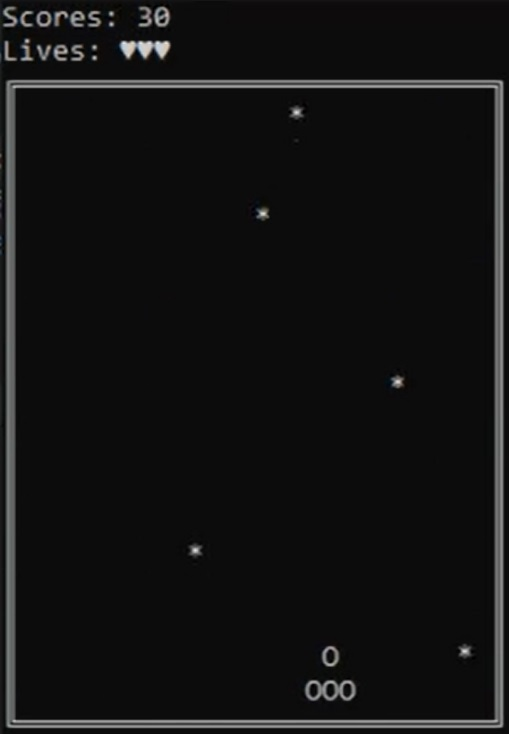

# StarShip

Игра про корабль, летящий через звезды.

TODO
1. ~~Полностью переписать код на функции.~~
2. ~~Использовать указатели для обращения к некоторым переменным.~~
3. ~~Добавить header и вынести все функции, разгрузить main.~~
4. Возможно, добавить звук...

## Установка и запуск

### Скачать

VisualStudio должен быть уже установлен.
[Скачать](https://github.com/Araime/StarFlight/archive/master.zip) этот 
репозиторий себе на компьютер. 

### Запуск
В папке с проектом запустить StarFlight.sln.

## Цель проекта

Совместная разработка игры в классическом аркадном стиле на чистом С++.
